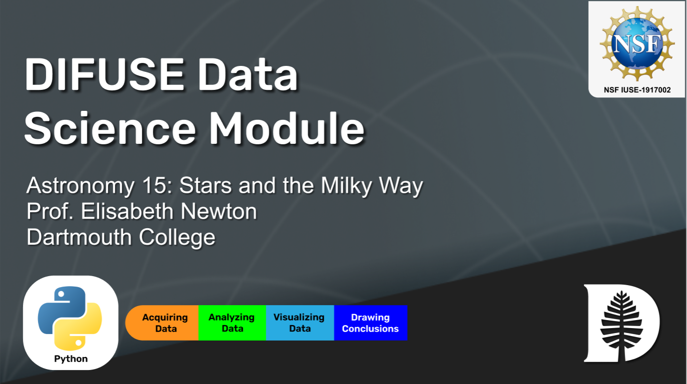
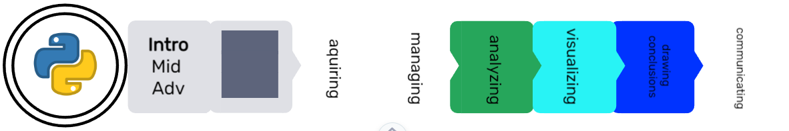

# ASTR 15 DIFUSE Module (Winter 2021) 

## Contributors: James Busch (GR), Garrett Scott ('22), Elisabeth Newton (Professor of Physics and Astronomy), Lorie Loeb (Professor of Computer Science, DIFUSE PI)

This module was developed through the DIFUSE project at Dartmouth College and funded by the National Science Foundation award IUSE-1917002.

 This work is licensed under a <a rel="license" href="http://creativecommons.org/licenses/by-sa/4.0/">Creative Commons Attribution-ShareAlike 4.0 International License</a>.

## Module Description

Stars and the Milky Way is an introductory astronomy course in the Physics and Astronomy Department.  It is a general introduction to astronomy and assumes no particular student background but instructors expect that about a third of students will have some python or coding background.  The module aims to introduce students to the way Astrophysicists manipulate data and perform analyses with an emphasis on data visualization and plot interpretation.  Students use a sequence of python notebooks to explore, analyze astronomical data.  This module uses python notebooks as its main tool and engages students in data analysis, visualization, and drawing conclusions. 

(<a href="https://github.com/difuse-dartmouth/.github/blob/8f8f6efff8943871e1fcaa3b6f2daf1531206df6/profile/howto.md">What does this badge mean?</a>)

## [Click here for module materials](completed_module/README.md)
For instructors and interested parties, the history of this repository (with detailed commits), can be found [here](https://github.com/difuse-dartmouth/ASTR15_W21/commits/main/).

## Folder Structure

The folder *completed_module* contains all of the module components.  

The *components* subfolder contains all of the assignments and documentation.

The *data* subfolder contains astronomical data sets used in the module.

